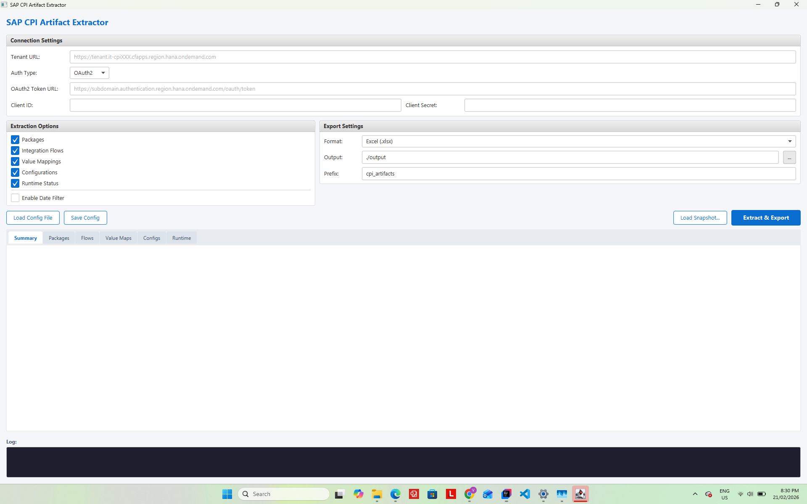
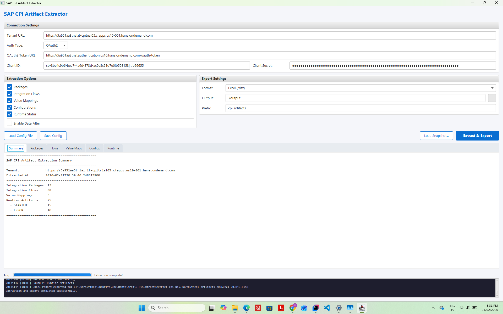
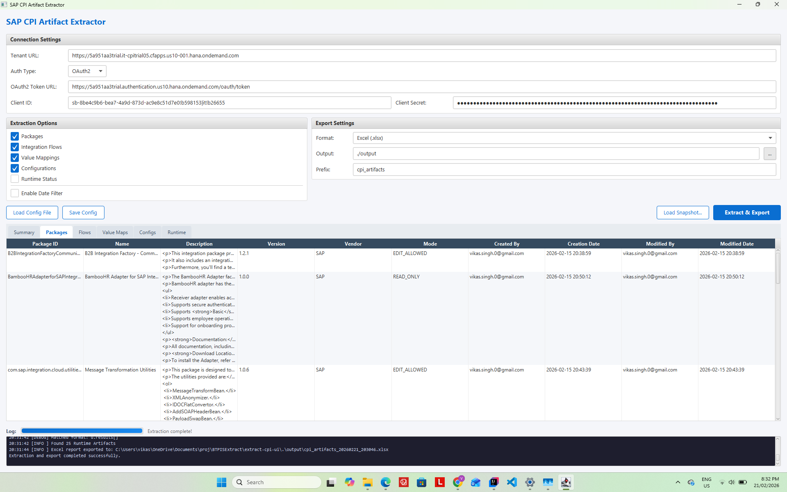
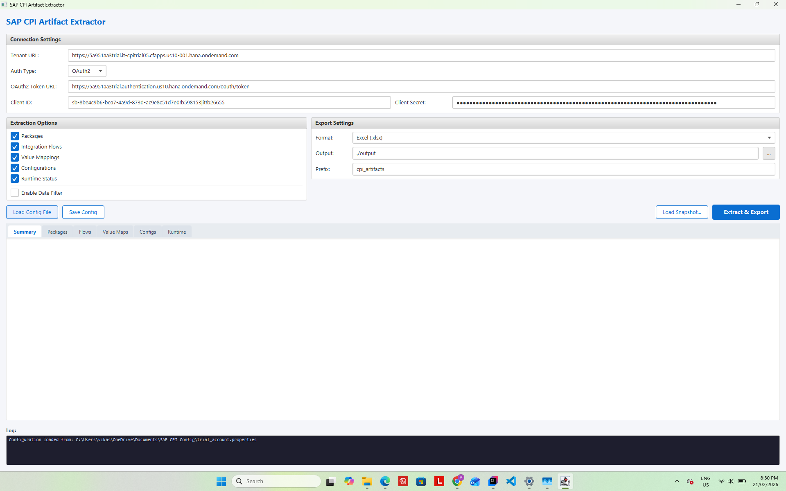
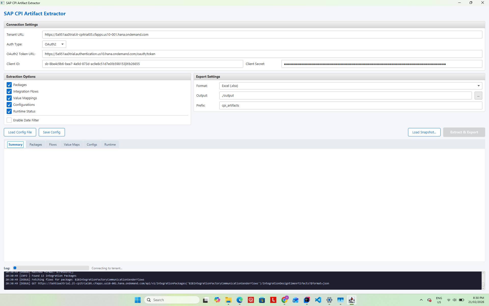
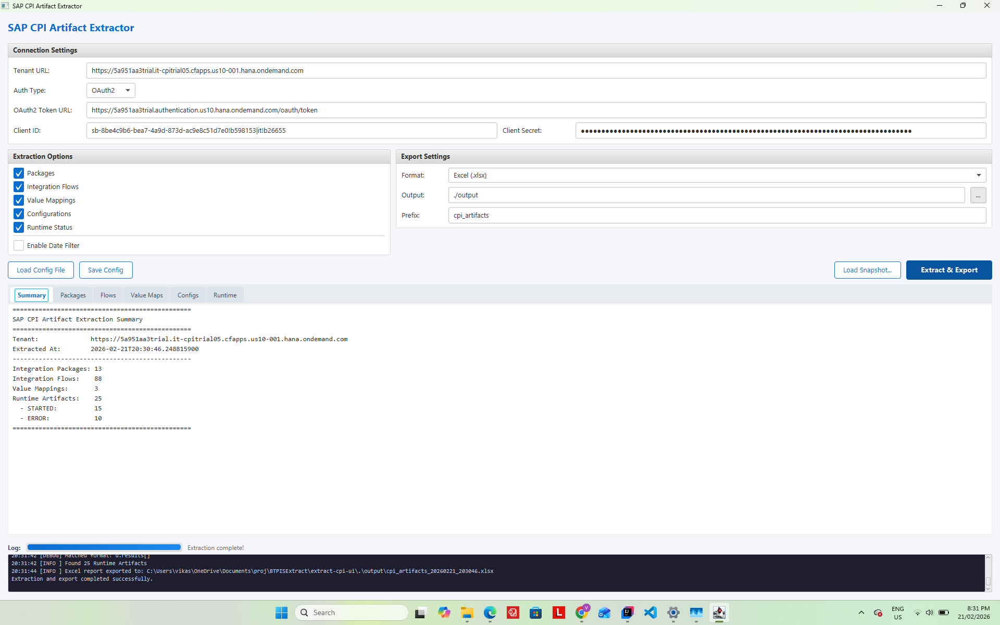

# SAP CPI Artifact Extractor – Tracking Your Integration Landscape During ECC to S/4HANA Migration

*Posted on SAP Community | Integration | Cloud Platform Integration*

---

I am currently working on an ECC to S/4HANA migration. We have a number of migration cycles and retrofit activities ahead of us, and one of the first things I needed was visibility into what was deployed on the CPI tenant and how it was changing over time. SAP does not provide a built-in way to extract this information in bulk. Let me walk you through a tool I built to support these cycles and retrofit activities.

The tool is open source: **https://github.com/viksingh/extract-cpi-ui**

---

## Background – Tools Are Not Optional at Scale

This is not the first time I have needed to build tooling to support a migration.

I have been working on SAP integration projects for a number of years. In previous projects on PI/PO, when you have tens of thousands of interfaces, manual processes simply do not scale. I built a number of tools back then to support migrations:

- **Communication channel extraction** – bulk export of all sender and receiver channels so the migration team could understand what existed without logging into each channel one at a time
- **Module parameter updates** – programmatic bulk changes to adapter module configurations across hundreds of channels at once
- **SLD object creation and updates** – automated management of System Landscape Directory entries for technical and business systems as new systems were introduced during each cutover wave
- **Mapping information extraction** – export of all mapping objects with their associated interfaces so we knew what needed to be rebuilt

The teams that had tooling finished cutover verification in hours. The teams that did not were still working through screens at 3am on go-live night.

Now I am on a CPI migration and facing the same problem. The platform has changed – it is OData and OAuth2 rather than XI protocol and basic auth – but the need is the same. With multiple cycles and retrofit activities planned, I need to know what is deployed, track how it changes between waves, and verify the state at each cutover.

---

## The Problem

SAP CPI's Design Time lets you browse packages and iFlows one at a time. There is no native way to export a full inventory of all artifacts – packages, flows, value mappings, configurations, runtime status – into something you can actually analyse.

For a large tenant with hundreds of iFlows across dozens of packages, this becomes a real problem when you need to:

- Take a baseline snapshot before migration starts
- See what has changed between migration waves
- Verify at cutover that the right flows are deployed and running
- Hand something to a functional team who does not have CPI access

---

## The Tool – extract-cpi-ui

`extract-cpi-ui` is a JavaFX desktop application that connects to your CPI tenant via the OData v1 API and extracts a complete inventory in one operation.

It runs on Java 17+. No SAP GUI. No additional BTP subscription beyond the CPI credentials you already have.

The tool was built over four months of weekend development from November 2025 through February 2026. All API interactions are read-only HTTP GET requests against the OData v1 endpoints. The only exception is a single POST request used to obtain an OAuth2 access token via the client credentials grant — the tool never writes to or modifies your CPI tenant.


*Figure 1: The application on first launch – connection settings, extraction options, and export format all visible in one window.*

### What It Extracts

| Artifact Type | Fields |
|---|---|
| Integration Packages | ID, Name, Version, Vendor, Mode, Created By, Creation Date, Modified By, Modified Date |
| Integration Flows | ID, Name, Package, Version, Sender, Receiver, Created By, Created At, Modified By, Modified At, Runtime Status, Deployed Version |
| Value Mappings | ID, Name, Package, Version, Created By, Created At, Modified By, Modified At, Runtime Status |
| Configurations | Artifact ID, Parameter Key, Parameter Value, Data Type |
| Runtime Artifacts | Artifact ID, Name, Type, Status (STARTED/ERROR/UNDEPLOYED), Deployed By, Deployed On |

Authentication supports OAuth2 client credentials (recommended for CF) and Basic Auth for Neo or service users.

All dates are displayed as `yyyy-MM-dd HH:mm:ss` rather than the raw SAP epoch format (`/Date(1234567890000)/`) that comes back from the API.


*Figure 2: Packages tab – all integration packages extracted from the tenant with version, vendor, and date information.*


*Figure 3: Flows tab – integration flows with package grouping, version, and runtime status visible at a glance.*


*Figure 4: Runtime tab – deployed artifacts with STARTED / ERROR / UNDEPLOYED status, deployed-by, and deployed-on columns for cutover verification.*

---

## Date Filter

One thing I needed specifically for the migration was the ability to filter by date. If I extract the full tenant today and again in two months, I want to see what changed in that period rather than looking at 550 iFlows again from scratch.

The date filter lets you narrow the results to artifacts created or modified on or after a date you choose. There are three modes:

- **Modified since** – anything touched since the date. This is the most useful one for tracking change between migration waves.
- **Created since** – net-new artifacts only. Useful for confirming what was built during a particular wave.
- **Created or modified since** – the union of both. Broadest view of activity since a date.


*Figure 5: Date filter enabled – choose a mode and a date to narrow results to what changed during a specific migration wave.*

The filter applies to packages, iFlows, and value mappings. A package is kept if it passes the filter itself or if any of its child artifacts pass – so you do not lose child artifacts because the parent package metadata was not updated.

The filter works on both live extractions and previously saved JSON snapshots. You can take a snapshot today, save it to disk, and reload it months later with a different date filter without touching the API again. This was important to me because production API access is sometimes restricted outside of maintenance windows.

---

## Export Formats

The tool exports to three formats. I added all three because they each serve a different purpose.

### Excel

A multi-sheet workbook with one sheet per artifact type. This is what I use to share with functional consultants and project managers who need to understand the integration landscape but have no CPI access. It is pivot-table-ready and you can filter and sort it without any technical knowledge.

### CSV

One file per artifact type. The reason I included CSV alongside Excel is that CPI artifact names and descriptions sometimes contain special characters – em dashes, Unicode in description fields, vendor-provided text in non-ASCII encodings. These can silently corrupt an Excel cell. CSV with proper quoting handles this safely and you can import it into any tool or process it on the command line.

### JSON

A single file containing the complete extraction result. Every field the API returned is preserved.

This is the format I care most about for the migration. The JSON file is a point-in-time snapshot of the tenant. I can reload it in the tool at any time and apply any date filter to the historical data.

One thing I have learned on migration projects is that the integration landscape is dynamic. Flows do not stay still while you migrate. Developers keep changing things, fixing bugs, adjusting configurations. Something you retrofitted in Wave 1 may have been modified again by Wave 3. Without snapshots you have no way to know what changed after you last looked at it, and retrofits done without this visibility tend to be incomplete or based on stale information.

By taking snapshots regularly throughout the migration, you have a record of the landscape at each point in time. When a retrofit task comes up you can compare the current state against the snapshot from when the retrofit was originally planned and see if anything has changed since. This makes the retrofit work more reliable and reduces the risk of missing changes that happened in the background.

I have plans to build a diff tool that takes two JSON snapshots and identifies:

- Flows that exist in the newer snapshot but not the older one – net-new, need to be built or verified on the target
- Flows in both but with different `ModifiedAt` dates – changed, configurations may need retrofitting
- Flows in the older snapshot but not the newer – removed, confirm this was intentional

By keeping a library of JSON snapshots taken at each migration wave, the diff tool will have everything it needs to generate that change log automatically.

---

## Migration Workflow

The way I use this in the current project:

**Before migration starts**

Extract the full tenant. Save the JSON. Export to Excel and share with the workstream leads so everyone knows what exists. This is the baseline.

**After each migration wave**

Extract with "Modified since" set to the wave start date. This shows only what was touched during that wave. Export to Excel for review. Save the JSON for the diff tool.

**Pre go-live**

Extract the full tenant again with no date filter. Check the runtime status sheet – everything that should be running should show as STARTED with no ERROR status. This is the cutover verification step that would otherwise require someone clicking through each iFlow manually.

**Post go-live**

Save the go-live JSON snapshot. When the diff tool is ready, this becomes the baseline for tracking any hypercare changes.

---

## Getting Started

You need Java 17 or later and OAuth2 credentials or a Basic Auth service user for your CPI tenant.

Download the JAR from the releases page:

```
java -jar cpi-artifact-extractor-ui-1.0.0.jar
```

No installation. The UI opens as a desktop window.

1. Enter your tenant URL
2. Select OAuth2 and enter your token URL, client ID, and client secret
3. Choose an export format – Excel for a first run
4. Set an output directory
5. Optionally enable the date filter and choose a date
6. Click Extract & Export


*Figure 6: Credentials loaded via Load Config File – tenant URL, token URL, client ID, and client secret populated in one click.*


*Figure 7: Extraction running – OAuth2 token obtained, packages and flows being fetched from the OData API.*


*Figure 8: Extraction complete – Summary tab with artifact counts, export path, and confirmation of the Excel workbook written to disk.*

Use **Save Config** to write your settings to a properties file. **Load Config File** restores everything in one click including the date filter settings.

To reload a saved snapshot: click **Load Snapshot...**, pick the JSON file. If you have the date filter enabled it will apply automatically without hitting the API.

---

## What Is Next

This is the first tool in a broader CPI toolset I am building to support the current ECC to S/4HANA migration. With multiple cycles still ahead and retrofit activities running in parallel, the tooling needs to keep pace with the project. The immediate next step is the snapshot diff tool mentioned above -- a direct requirement for comparing the landscape state between cycles. After that I have plans for cutover verification reports and a few other things driven by what each upcoming cycle surfaces.

The code is on GitHub if anyone wants to contribute or adapt it for their own use:

**https://github.com/viksingh/extract-cpi-ui**

---

*If you have faced similar challenges managing a CPI tenant during a migration, or if you have built tools of your own for this, I would be interested to hear about it in the comments.*
